Does popularity of technology on StackOverflow (SO) influence popularity
of post about this technology on Hacker News (HN)?
================
dgwozdz & pmigdal 
3rd JUNE 2018

Last update: 6th JUNE 2018

## Table of Contents

1)  [Introduction](#intro)
2)  [How to cope with problem](#suggested-solutions)
3)  [Exploratory Data Analysis](#eda)
4)  [Granger causality](#granger)
5)  [Summary](#summary)
6)  [Further research](#further)
7)  [Acknowledgments](#acknowledgments)

-----

## 1\. Introduction 

***Causality** (also referred to as causation, or cause and effect) is
what connects one process (the cause) with another process or state (the
effect), where the first is partly responsible for the second, and the
second is partly dependent on the first. In general, a process has many
causes, which are said to be causal factors for it, and all lie in its
past.*[1](#f1)

Causality is a phenomenon which people intuitively understand but which
is tough to measure with statistical methods. Let’s say you would like
to build a model which explains the behaviour of defaults on mortgages.
You may use the following data explaining a lack of repayments: clients’
incomes, GDP, clients’ heights, their genders etc. You employ a
regression/decision tree/neural network and it seems that the best
predictors are sex and height. Does that mean that those variables
influence defaults? It may just be a spurious correlation. Those
variables may include other information, not directly implied by
themselves (e.g. that there is a gap in salaries between genders). You
may have not considered other important variables (e.g. number of kids,
length of employment, the history of previous loans if it’s available),
so the data you put in your model are statistically significant. Or,
because such a situation is also possible, the significant variables do
indeed influence defaults but you just don’t understand the dependence
of those phenomena. The causality seems to be a tough thing to identify.

Nevertheless, let’s talk about it in different context. I decided to
measure the influence of the popularity of a given programming language
on Stack Overflow on the popularity of posts with that technology on
Hacker News. *Wait,* you may say, *what are you talking about?*

### Stack Overflow (later referenced as SO)

If you’re a programmer or your profession/hobby has anything to do with
programming, you’re probably familiar with this one. [Stack
Overflow](https://stackoverflow.com) (SO) is an established in 2008
portal on which programmers help each other by asking and answering
coding questions. If you have a programming problem, there’s a pretty
good chance that someone else had to deal it previously, asked about it
on Stack Overflow and got an answer. The questions and replies/comments
are evaluated in a form of points so it is usually instantly obvious
which answer was rated the highest (and therefore is considered as the
best one by the community) or whether a described problem is
reproducible, i.e. you can replicate it with a piece of code prepared by
a person asking a question.

### Hacker News (later referenced as HN)

[Hacker News](https://news.ycombinator.com/) is an established in 2007
portal on which users submit interesting links/stories. Those stories
gather points just like questions on SO (however, users cannot downvote
stories until they reach a certain karma treshold). Each post can be
commmented
on.

## 2\. How to cope with problem 

### Popularity and influence

What is a popularity and how to measure it in the context of SO and HN?
It could be defined as liking or attraction to a certain person, an idea
or, in our case, a technology. In the context of this analysis you can
name at least a few metrics by which you could measure whether something
is popular or not. Additionally, they should be measured in a certain
time unit, e.g. daily. If data that we would like to analyse can be
identified by an ordered time index (the unit is irrelevant) that means
that we deal with a **time series**.

I suggest starting the analysis with variables such as a number of
questions (SO) / posts (HN) for a given programming language and points
gathered by those questions (SO) / topics (HN). Those two are probably
the most universal ones. Of course, you could come up with much more
variables, for example:

1)  number of times questions from a certain time span (e.g. from a
    given day) were tagged as a favourite,
2)  number of comments for questions from a certain life span,
3)  number of views of questions from a certain life span,
4)  number of replies for questions from a certain life span.

However, there is a small problem with variable c): the number of views
seems to be irreproducible. SO shows only the number of views a given
question gathered by today’s date, so obtaining this variable from
different time points (e.g. from 1st June 2018 and
2nd June 2018) results in different values.

When it comes to obtaining data from Satck Oveflow, it was easy to
identyify which question is assigned to which technology. Every question
has its tags. The process of data preprocessing was a bit tougher in
case of Hacker News. The definition of a topic related to a certain
technology is a topic, in which the name of this technology appears
either in a title or in the text (comments were not taken into
consideration).

The selected variables: number of questions/topics/point were usually
analysed in four pairs:

1)  number of questions on SO vs. number of topics on HN,
2)  number of questions on SO vs. number of points on HN,
3)  number of points on SO vs. number of topics on HN,
4)  number of points on SO vs. number of points on HN.

I have previously written that all variables should be measured in a
certain time unit, which leads to the next issue: how to aggregate data
from a certain period? I decided to use a sum as an aggregation
function, e.g. sum of questions which appeared in a certain day. You
could come up with, for example, an average. However, the problem with
such a metric could be small samples on the basis of which it would be
computed (for example, a mean number of points gathered by questions on
SO from a given day when during that 24 hours only one or two posts
popped up), which would be unrepresentative.

How to cope with the problem of causality: one phenomenon partially
influencing another? The **first approach** could be an EDA -
**Exploratory Data Analysis**, which basically means producing some
plots and trying to indicate something from them. The plus of this
solution is the visual aspect: you can clearly see the trend of (or a
lack of thereof) of a popularity for a given programming language and
for most people it is easier to read plots than just bare tables. The
somewhat hindering side of the method to unravel causality is its
qualitative character - there is no statistic/test indicating whether
your conclusions on the basis of plots are correct or not.

The **second approach** a qualitative one: a **Granger causality**.
*Wait a minute,* you may ask, *you were talking about causality and now
you’re saying that there’s a specific type of causality?* Basically
saying, yup. Granger causality, proposed in 1969, determines whether one
time series is helpful in forecasting another time series. Note that the
question: *Does one phenomenon is a cause of another one?* is different
from what Granger causality measures: here you only use past values of a
given variable and try to use them to forecast the future values of
another phenomenon, just like building a forecasting model. Therefore,
this type of causality is called a *predictive causality*.

### Data

Data from this analysis, comes from two sources: (quite obviously) Stack
Overflow and Kaggle (surprise\!). [Kaggle](https://www.kaggle.com/) is a
website which organizes competitons for data scientists/analysts which
goal is to build the best predictive model for a given phenomenom based
on shared data set(s). It also provides some data sets which are not
strictly for competitions but can be used in EDA (Exploratory Data
Analysis). The data utilised in this analysis with regard to Hacker News
comes from [the latter](http://kaggle.com/hacker-news/hacker-news).
Variables regarding Stack Overflow comes from queries utilized in [Stack
Exchange Data Explorer](http://data.stackexchange.com/stackoverflow)
which allows anyone interested to write SQL queries for Stack Overflow
as well as other Stack databases. The data were gathered from the period
**15th September 2008 - 31st December 2017.**

The programming languages or technologies which were examined include:
C, C++, C\#, Cobol, CSS, D3.js, R, Delphi, Fortran, Hadoop, HTML, Java,
Javascript, JQuery, Pascal, Perl, Python, PHP, Ruby, Rust, Scala, Shell,
Spark, SQL, Swift, Tensorflow, VBA. The choice of technologies was
arbitrary.

The data from portals were assigned specific colors:
grey for Stack Overflow,
orange for Hacker News. Those colours
are consistent with the ones used later on so that it would be easier to
identify the source of data (Stack Overflow or Hacker News).

## 3\. Exploratory Data Analysis 

One of the ideas with regard to examining causality included checking
cumulative plots. Cumulative plots show aggregated value of a given
measure to a given date. For example, if we have data in such a form:

| Date       | Value |
| ---------- | :---: |
| 2018-01-01 |   1   |
| 2018-01-02 |   2   |
| 2018-01-03 |   3   |

Then the cumulative value would be sum of all the values up to a given
date:

| Date       | Value | Cumulative value |
| ---------- | :---: | ---------------: |
| 2018-01-01 |   1   |                1 |
| 2018-01-02 |   2   |                3 |
| 2018-01-03 |   3   |                6 |

### 3.0 C\# 

Exemplifying, the plot below shows:

1)  cumulative number of questions asked for C\# on
    Stack Overflow to the date on x axis
    (grey line),
2)  cumulative number of points gathered by all topic with regard to C\#
    on Hacker News to the date on x
    axis (orange line).

It can be noticed that by the end of 2017 the cumulative number of
questions on SO exceeded 50 thousand
while in the same time the number of points for topics with C\# on
HN reached about 30
thousand.

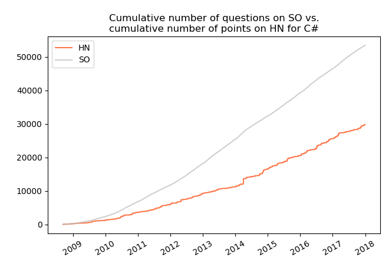

Above described plot for C\# does not seem particularly interesting. It
shows (rather obviously) an upward trends for both variables, however,
the dynamic for them is different. What is more, it would be nice to see
a standardized variables, for example in such a way that they both start
at 0 and end at 1. Thanks to such a data transformation technique it is
possible to find time series which may be similar in terms of behaviour
in time but different when it comes to differences by which they
increase (or decrease). The plot for the same phenomena and technology
as above but with standardized variables is presented
below:

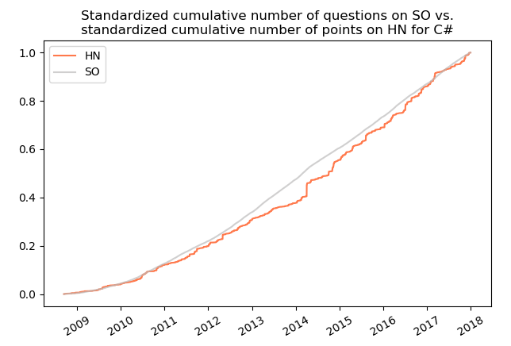

Now it can be noticed that the cumulative number of questions on
SO and the cumulative number of points
for topics on HN show strong
resemblance. Similar resemblance can be seen when comparing standardized
plots of cumulative number of questions vs. cumulative number of
topics:

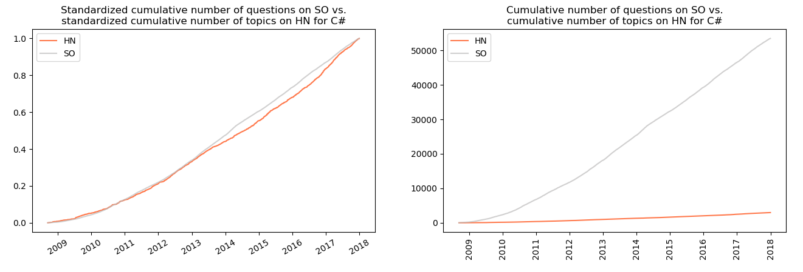

Let’s see some interesting similarities between statistics on
SO and
HN for different technologies on
standardized plots. We will only see the technologies for which I
identified somme sort of similarity between data from
SO and
HN or for which I discovered something
interesting. Additionally, plots on the left will be the ones for
standardised variables while those on the right for variables without
transformation (standardisation).

### 3.1 C

Similarly to C\#, there is visible resemblance between cumulative number
of questions on SO and cumulative number
of points for topics on
HN:

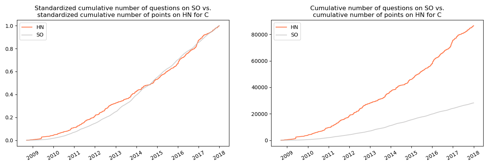

as well as in case of cumulative number of questions on
SO and cumulative number of topics on
HN:

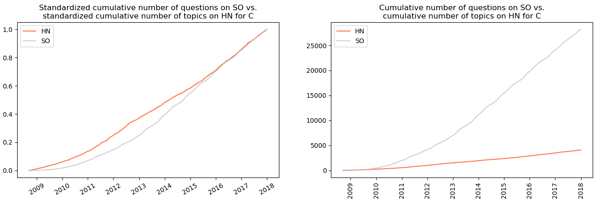

### 3.2 C++

Not surprisingly, in case of C++ the similarities existing for C and C\#
are
repeated.

### 3.3 Cobol

Yes, Cobol. I wanted to say (write) *good, old Cobol*, however, I find
such statement to be a little exaggeration for this, I would say
*antique* programming language. If you don’t know what Cobol is, its
name is an acronym from *common business-oriented language*, which
resembles high similarity to English language. The aim of such a design
was to be readable for both programmers and non-technical staff like
managers. It was introduced in 1959(\!) and was/is used in variety of
environments, including banking and insurance.

The plot below shows a high resemblance of cumulative number of
questions on SO and cumulative number of
topics with regard to this programming language on
HN.

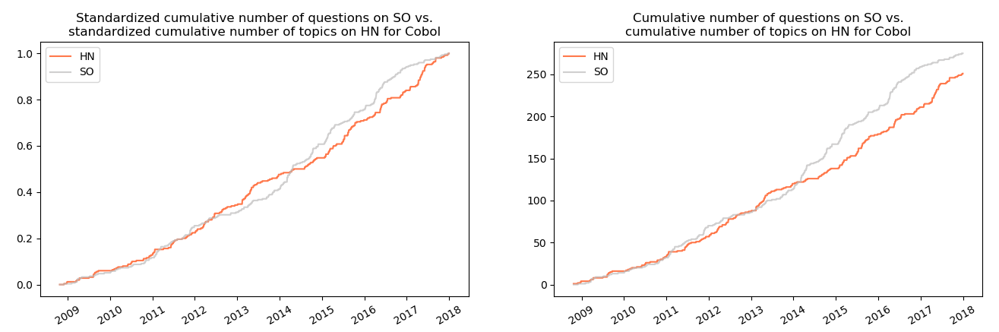

It is worth noticing that in a span of about 9 years less than 300
questions appeared on SO, which shows
low or even lack of popularity of this technology nowadays.

### 3.4 CSS

Similar resemblance is observed between the cumulative number of
questions on SO and the cumulative
number of points gathered by the topics on
HN.

.and between the cumulative number of questions on
SO and cumulative number of topics on
HN:

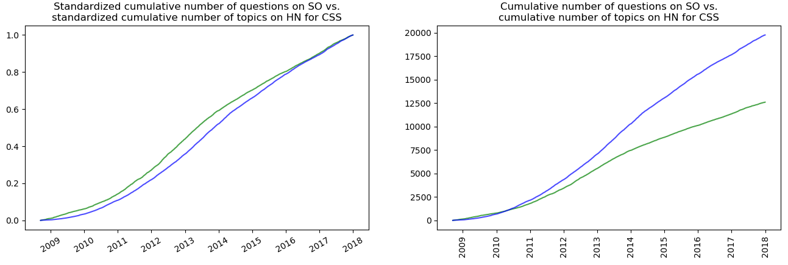

### 3.5 D3.js

In case of Javascript visualization library D3.js a resemblance is
observed between the cumulative number of points obtained by questions
on SO and the cumulative number of
points gathered by topics on
HN:

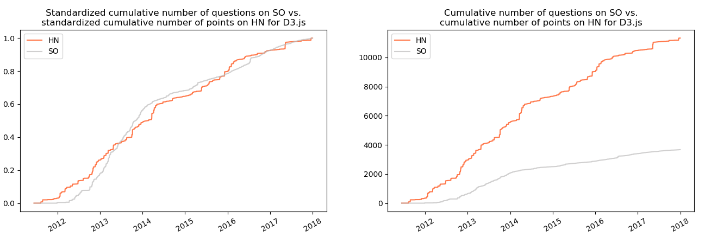

### 3.6 Delphi

For Delphi the cumulative number of questions on
SO seems to follow the same trend as the
cumulative number of topics on Hacker
News:

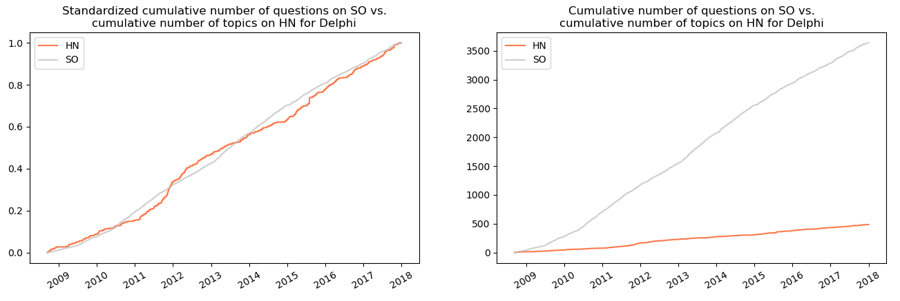

### 3.7 Fortran

When it comes to Fortran, the similarity is observed between the
cumulative number of questions on SO and
the cumulative number of topics on
HN.

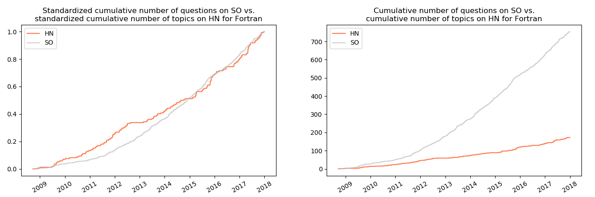

Similarly to Cobol, this programming gathered only 700 question in over
9 years which indicates its unpopularity.

### 3.8 Hadoop

In case of Hadoop, the cumulative number of questions on
SO seems to be similar to the cumulative
number of points on HN. What’s
interesting here is the change of dynamic in 2013: since the middle of
this year the number of question on SO
grows faster than the number of points on
HN.

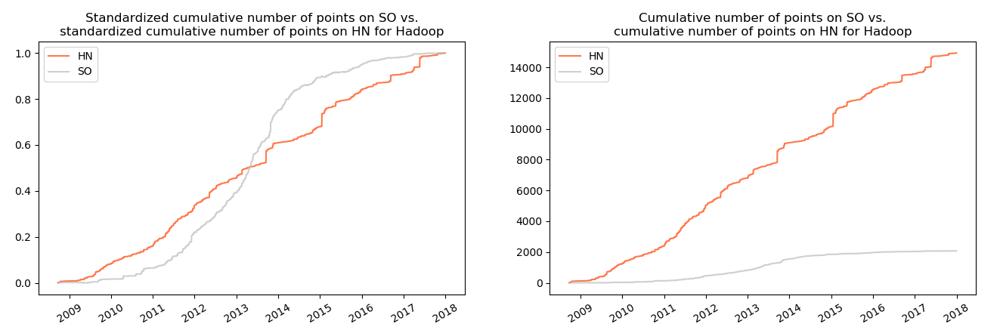

### 3.9 HTML

In case of HTML there was no resemblance between variables.
Nevertheless, the interesting fact is that since 2014 the number of
point for questions on SO stabilizes and
later slightly decreases by about 5%, which is shown on the plot
below:

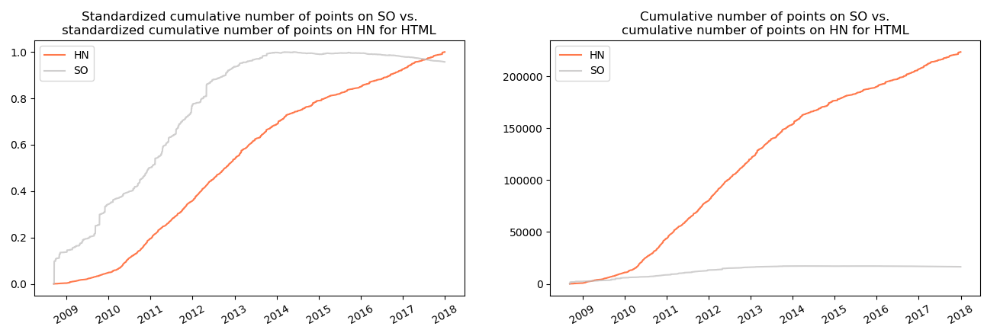

Such a situation occurred due to greater number of downvotes than
upvotes. This may be result of high number of duplicates since 2014 or
the questions which were not formulated in a clear way or were not
reproducible (and therefore were downvoted).

### 3.10 Java

In case of Java the resemblance is visible between the cumulative number
of questions on SO and the cumulative
number of topics on
HN:

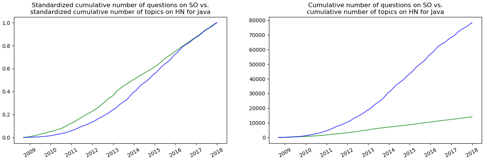

Like in the case of HTML, here the cumulative number of pointsalso
levels off in 2014 to fall slightly by the end of 2015. The significant
drop is observed by the end of
2017.

### 3.11 Javascript

In case of Javascript the similarity is observed between the cumulative
number of questions and cumulative number of topics on
HN…

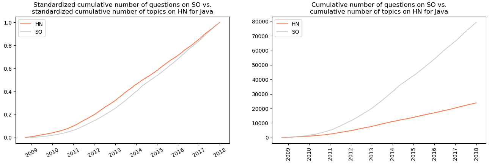

…as well as between the cumulative number of questions on
SO and the cumulative number of points
between questions on
HN:

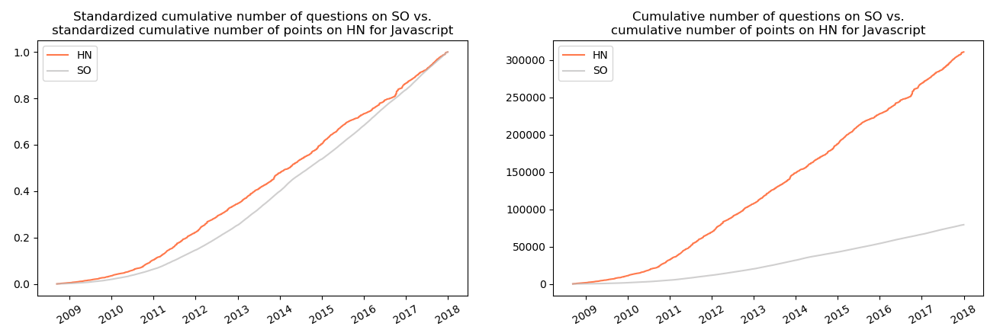

### 3.12 Pascal

In case of Pascal the cumulative number of questions on
SO tends to resemble the cumulative
number of points for topics on
HN:

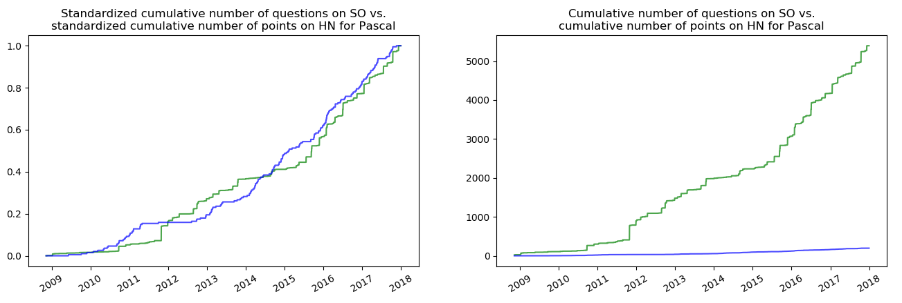

However, in case of this programming language an analogous to HTML and
Java situation is visible: the cumulative number of points achieves its
peak between 2013 and 2014. In the later years it plummets to be reduced
by half by the end of
2017.

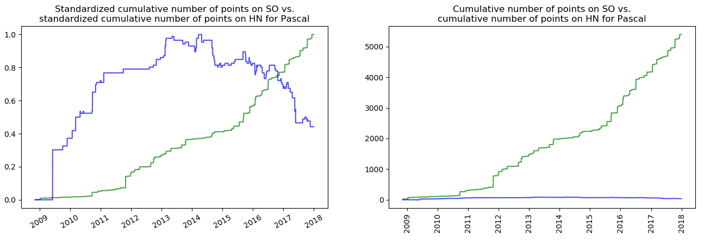

### 3.13 Perl

The cumulative number of questions on SO
seems to resemble the cumulative number of points on
HN…

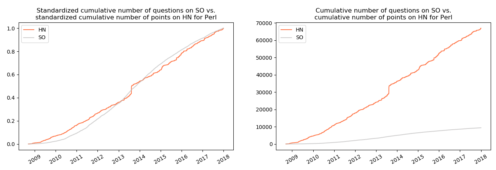

…and the cumulative number of topics on
Hacker News related to
Perl.

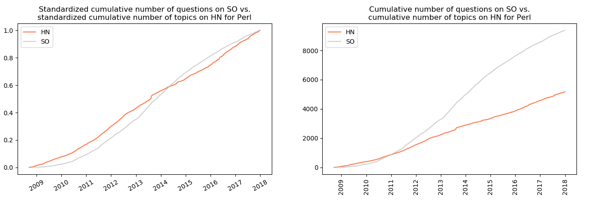

### 3.14 PHP

In case of PHP only the drop of the cumulative number of points of
questions on SO is
visible:

### 3.15 Python

In case of Python the visible similarity appears between the cumulative
number of questions on SO and the
cumulative number of points for topics on
HN…

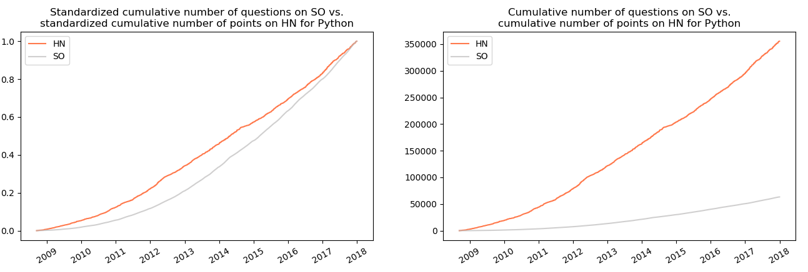

…as well as for the cumulative number of questions on
SO and the cumulative number of topics
on
HN:

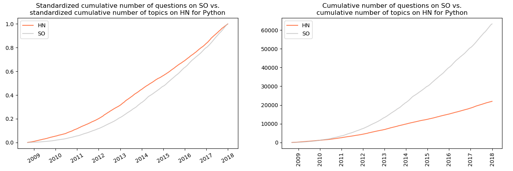

### 3.16 Shell

The visible similarity appears between the cumulative number of
questions on SO and the cumulative
number of points for topics on
HN.

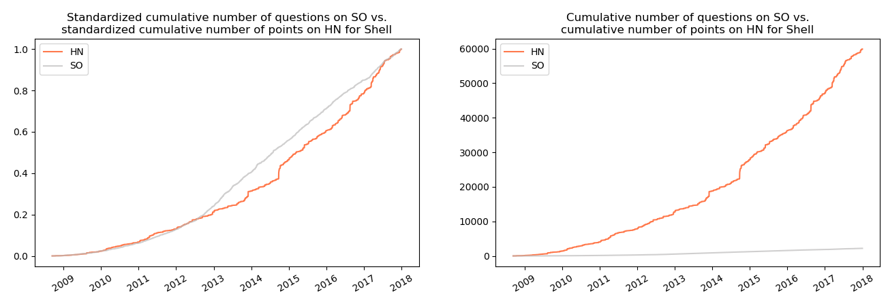

.as well as between the cumulative number of questions on
SO and the cumulative number of topics
on
HN:

### 3.17 Spark

The same situation: the similarity can be identified between the
cumulative number of questions on SO
and:

1)  the cumulative number of points for topics on
    HN:

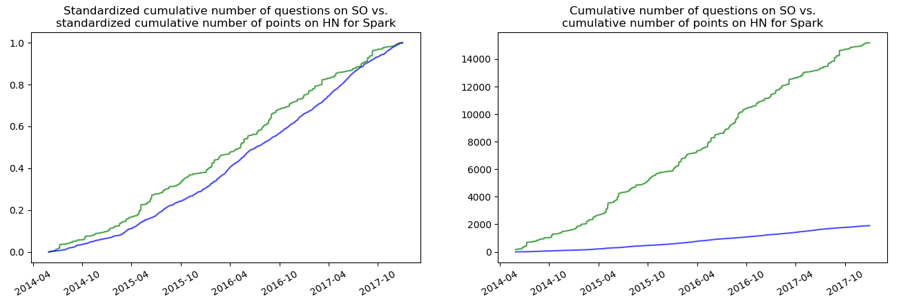

1)  the cumulative number of topics on
    HN:

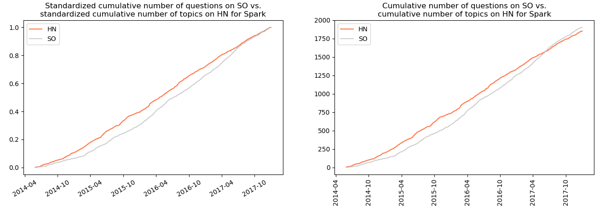

### 3.18 SQL

In case of this technology, the variables characterized by similar
trends are the cumulative number of questions on
SO and the cumulative number of topics
on
HN:

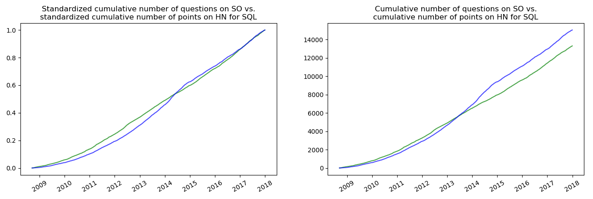

In addition to that, this technology is also characterized by the
decrease of cumulative number of points since 2014 by about 20
percent.

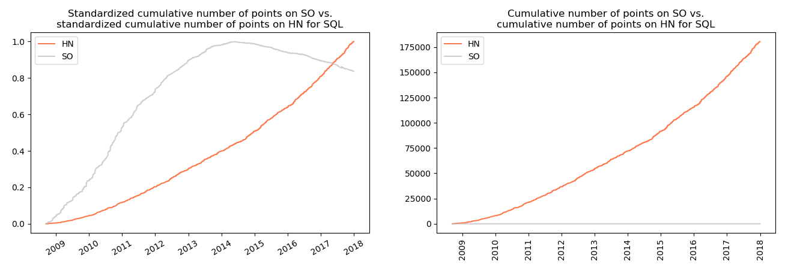

### 3.19 Swift

In case of swift there also seems to be a similarity between the
cumulative number of questions on SO
and:

1)  the cumulative number of points on
    HN:

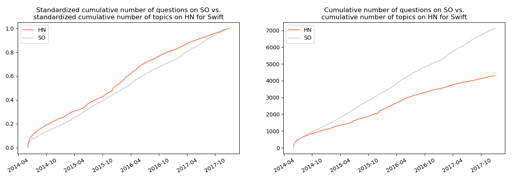

2)  the cumulative number of topics on
    HN:

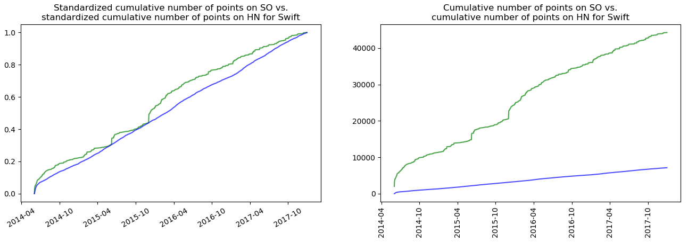

### 3.20 Tensorflow

In case of Tensorflow, the highest visible resemblance was identified
between the cumulative number of questions on
SO and the cumulative number of topics
on
HN:

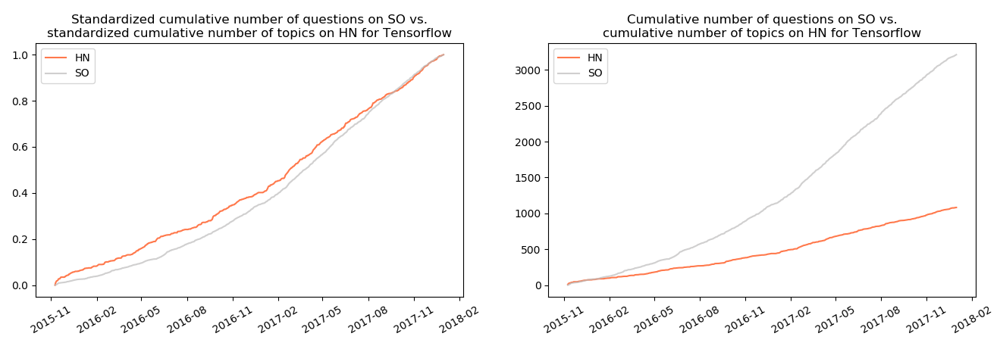

-----

There are a couple of problems with above given visual identifications:

1)  First of all, they are subjective. The terms *similarity* and
    *resemblance* were not quantified. It is only possible to compare
    those plots visually.
2)  Secondly, those time series are obviously nonstationary (they do not
    have the same moments through the period of observation) and
    therefore cannot be used in statistical methods.
3)  Last but not least, EDA does not answer the question of causality.
    Even if you agree with my subjective opinions of similarity of those
    time series, it is not possible to determine whether one is or isn’t
    the cause of another. In order to cope with those issues, I used
    Granger causality.

## 4\. Granger causality 

Granger causality informs whether one variable is useful in forecasting
another variable. The test takes a form of performing two linear
regressions[2](#f2):

1)  The first one, in which the potential resulting time series is
    explained by its past values (autoregressors):

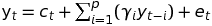

where:

  - 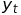 - potential result in period
    \(t\),
  - 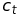 - intercept,
  - 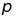 - number of autoregressors (past
    values),
  - 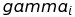 - coefficient for i-th
    autoregressor (i-th past value) of potential result,
  - 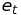 - error term.

<!-- end list -->

2)  In the second one the same regressand (potential resulting time
    series) and its past values (autoregressors) are used, however, the
    past values (autoregressors) of potential cause are added as well:

where: 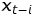 - potential cause in
period \(t-i\), 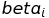 - coefficient
for i-th autoregressor (i-th past value) of potential cause,
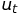 - error term.

The null hypothesis is that all the added past values of the potential
cause are equal to 0:

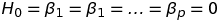

The computed statistic takes such a form:

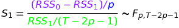

where:

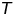 - number of observations
(elements in time series) 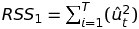

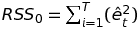

Let’s try to interpret it.

1)  The difference 
    in the numerator is the difference between error terms of the
    regression without the potential cause and with the potential cause.
    It can be interpreted as the error reduction resulting from the
    autoregressors of a potential cause.
2)  This difference is divided by the number of additional parameters in
    the regression with the potential cause:
    . Notice that the number
    of estimated parameters in the regression
    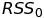 is almost the same:
    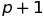. Additional parameter
    over  is just the intercept.
3)  If we divide the difference by the number of additional parameters,
    we obtain the average error reduction per each new parameter in the
    regression with the potential cause.
4)  The second element - denominator
     - is the error
    term of the regression with the potential cause divided by the
    number of degrees of freedom (number of observations minus the
    number of estimated parameters). It can be interpreted as an average
    error per one degree of freedom.
5)  Let’s wrap it up: the nominator is the average error reduction in
    the regression with the potential cause. The denominator represents
    the average error per degree of freedom of the regression with the
    potential cause. The entire statistic can therefore be interpreted
    as **an average error reduction per degree of freedom of the
    regression with added autoregressors of the potential cause**.

Now we know what we want to use, however, we don’t know if we can use
it. Let me just remind that we’re dealing with time series. One of time
series properties is that they can be nonstationary i.e. the
realizations of the examined process may not come from the same
distribution over time. Using nonstationary time series in linear
regression may lead to so called spurious regression in which the
modelled dependencies between a regressand and regressors are really
nonexistent. In order to avoid such a situation, the times series should
be transformed to stationary ones *a priori*. It is obtained by
differencing.

How to check whether a given time series is (non)stationary? One of
possible solutions for this task is employing an Augmented Dickey-Fuller
test. Its null hypothesis is that the series is nonstationary. There are
two versions of the test utilized in this article:

1)  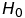: nonstationary time series,
    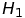: stationary time series,
2)  : non-stationary time series,
    : trend-stationary time series.

Detection whether a time series includes a trend is performed by
regressing it against the time (time series from 1 to n, where n is the
number of observations in the examined time series) and checking whether
the estimated coefficient by the trend is statistically significant for
the determined significance level
 (in this case
 = 0.05). If the coefficient is
statistically significant, the ADF test with constant and trend is used,
otherwise only with a constant.

After each time series is transformed (if necessary) to a stationary
one, a Granger causality test is performed. Here an important question
should be asked: how many autoregressors should be considered? It was
pointed out that this number should be dependent on minimum value of
information criteria: in case of this article, Akaike and Bayes. It was
remarked that the former tends to choose the overfitted while the latter
the underfitted model, so neither of them is perfect. Nevertheless, the
analysis indicates that they often suggest the same lag. Maximum
considered lag was 36 periods (3 years).

The ADF test, differencing and the Granger causality test were performed
on data aggregated to monthly frequency in order to reduce the daily
noise in number of questions/points for examined variables. In order to
check if Hacker News does not influence popularity of technology on
Stack Overflow, the opposite hypotheses were also examined.
Statistically significant results when
 is rejected (for significance level
= 0.05) are presented in the
table
below:

| No | Technology | Regressand (Y)            | Regressor (X; potential cause) | AIC    | BIC    | max lag | min AIC | min BIC | p.value | Differentiations of Y | Differentiations of X |
| -- | ---------- | ------------------------- | ------------------------------ | ------ | ------ | ------- | ------- | ------- | ------- | --------------------- | --------------------- |
| 1  | swift      | Number of posts on HN     | Number of points on SO         | 188,29 | 226,13 | 13      | True    | True    | 0,01    | 0                     | 0                     |
| 2  | css        | Number of posts on HN     | Number of points on SO         | 123,18 | 292,36 | 36      | True    | True    | 0       | 1                     | 0                     |
| 3  | html       | Number of points on HN    | Number of questions on SO      | 822,3  | 991,48 | 36      | True    | True    | 0,02    | 1                     | 1                     |
| 4  | java       | Number of posts on HN     | Number of points on SO         | 43,06  | 211,26 | 36      | True    | True    | 0,03    | 1                     | 2                     |
| 5  | jQuery     | Number of points on SO    | Number of points on HN         | 269,49 | 438,67 | 36      | True    | True    | 0       | 1                     | 1                     |
| 6  | jQuery     | Number of posts on HN     | Number of points on SO         | 95,03  | 264,2  | 36      | True    | True    | 0,01    | 1                     | 1                     |
| 7  | tensorflow | Number of questions on SO | Number of points on HN         | 143,91 | 155,48 | 6       | True    | True    | 0,04    | 2                     | 1                     |

Explanations of consecutive columns:

1)  **No** - ordinal number,
2)  **Technology** - technology, for which the variables were checked,
3)  **Regressand (Y)** - variable, which is potentially influenced by a
    regressor,
4)  **Regressor (X; potential cause)** - variable, which is a potential
    cause for the regressand,
5)  **AIC** - value of AIC,
6)  **BIC** - value of BIC,
7)  **max lag** - lag, for which AIC or BIC has the minimum value,
8)  **min AIC** - boolean value indicating whether minimum AIC was
    obtained for the considered maximum lag,
9)  **min BIC** - boolean value indicating whether minimum BIC was
    obtained for the considered maximum lag,
10) **p.value** - p-value of the performed test,
11) **Differentiations of Y** - number of times the regressand was
    differentiated before being transformed to a stationary variable,
12) **Differentiations of X** - number of times the regressor was
    differentiated before being transformed to a stationary variable.

The table with results of Granger causality test suggests a few things:

1)  First of all, in case of Swift the number of points for questions
    appearing in a given month is Granger-causes the number of topics on
    Swift appearing in a given month on Hacker News. The same situations
    happens in case of CSS, Java and JQuery
2)  Secondly, in case of HTML the number of questions in a given month
    Granger-causes number of points for topics with regard to HTML on
    Hacker News.
3)  Thirdly, in case of Tensorflow the dependency seems to be reversed:
    number of points for topics appearing in a given month on Hacker
    News Granger-causes number of questions popping up in a given month
    on Stack Overflow.
4)  Last but not least, in case of JQuery there seems to be a two-way
    dependence between Stack Overflow and Hacker News:

<!-- end list -->

  - the number of points for topics appearing in given month on HN
    Granger-causes number of points for questions on SO, and
  - the number of points for questions appearing in a given month on SO
    Granger-causes number of topics with regard to JQuery on HN.

<!-- end list -->

5)  Additionally, in case of examples above both criteria (AIC and BIC)
    suggested the same maximum lags.
6)  None of the results in the table is corroborated by the previous
    exploratory visual analysis. In case of data aggregated to weekly or
    daily frequency the number of statistically significant results
    would be greater, however, it such situations could take place
    randomly.

## 5\. Summary 

It’s high time to ask the most important question: do the results of the
quantitative analysis - Granger test - indicate that in case of those
technologies and variables the popularity of technology on Stack
Overflow causes the popularity of technology on Hacker News?

-----

The question seems to be clear. However, answering it seems to be not an
easy job. Nevertheless, let’s try.

1)  Hacker News is a portal used by lots of programmers. Programmers use
    Stack Overflow all the time. **It seems intuitive that the more
    popular technology on Stack Overflow, the more people interested in
    it and therefore the more topics/points for topics with regard to it
    on Hacker News**.
2)  For a start, **there seems to be a some sort of resemblance between
    data on Hacker News and Stack Overflow**, which is indicated by the
    exploratory data analysis. **Significant results of Granger
    causality tests corroborate this statement**.
3)  **There are a couple of pairs in which variable from HN was the
    potential result, for which the null hypothesis of Granger causality
    test (variable does not Granger-causes another variable) was
    rejected.** It shouldn’t be taken lightly as some of those variables
    were differentiated (once or twice) and differentiation removes some
    information from a given variable.
4)  Additionally, in case of two technologies (JQuery and Tensorflow)
    the variables regarding data from SO were pointed out as potential
    results of variables from Hacker News. **The idea of Hacker News
    influencing popularity of technology on Stack Overflow** is not so
    easy to accept (at least for me) as the opposite one, nevertheless,
    it **shouldn’t be entirely disregarded**.
5)  On the other hand, the **visual analysis** may only point out some
    sort of relationship. It **means neither causality nor does it
    indicate which variable is the cause and which an effect**.
6)  **The Granger causality tests were statistically significant only
    for a couple of pairs**. In case of such a number of performed tests
    (216; 27 technologies x 4 pairs x 2 because both directions: HN ~ SO
    and SO ~ HN were examined) it could happen that by coincidence a
    couple of pairs were statistically significant.
7)  As mentioned earlier, the Granger causality can be identified as a
    **predictive causality**: it means that a possible variable-cause
    can be used as a predictor in forecasting the possible
    variable-effect. Such a statement **does not imply that the
    regressor useful in forecasting is a real cause of a given
    process**.
8)  **Popularity of topics on Hacker News can be determined by lots of
    factors. Stack Overflow may be only one of them**. When using a
    framework identifying Granger-causes with more than one regressor
    the SO-variables may lose its statistical significance in favour of
    other variables (which, in turn may or may not be the causes of
    popularity of a given technology on Hacker News).
9)  I wrote earlier that change of aggregation frequency (to
    monthly/daily basis) causes more pairs to be statistically
    significant. Those options were neither presented nor further
    described due to the high number of statistically significant
    results as well as a fear that those results may be significant by
    accident.
10) **The number of maximum lags considered lags in Granger causality
    test was set to 36 any real indication that this number is
    *right***. It could be higher (in case of technologies which have
    longer history) or lower. If latter, more pairs could be
    statistically significant, however, there is a serious anxiety that
    obtaining more significant pairs by shortening the checked window
    would not mean that there really is a cause-effect relationship; it
    might rather be showing significant results for the sole purpose of
    showing something significant, i.e. a variant of p-hacking.

As a side-effect of this side-project (sic\!) I find it interesting that
there are technologies (HTML, Java, SQL, Pascal, PHP) in case of which
the number of negatively rated questions high (or the number of negative
points for some questions) was so high that the cumulative number of
points for those technologies dropped (even by a half from its maximum).

To sum up: does popularity of technology on StackOverflow (SO) influence
popularity of post about this technology on Hacker News (HN)? **There
seems to be a relationship between those two portals but I could not
determine that popularity on Stack Overflow causes popularity on Hacker
News.**

## 6\. Further research 

Further research in this topic may include:

1)  Investingating other technologies (e.g. if tensorflow was checked,
    e.g. keras and pytorch could be included.
2)  Using other, named or unnamed above variables (e.g. number of times
    questions were flagged as favourites in a certain life spans).
3)  Using other statistical methods.
4)  Computing correlations. However, Pearson correlation detects only a
    linear dependence (and should be computed on stationary series) and
    only answers a question of dependence, not causality.

## 7\. Acknowledgements 

I would like to thank [Piotr Migdal](http://p.migdal.pl/) for the
suggestion of this topic, his research ideas and the overall supervision
of this analysis. Also, many thanks to Jan Bendarz for suggesting a
method of trend detection and [Andrzej
Drzystek](https://github.com/adrzystek) for thoughts on an initial
draft.

<b id="f1">1: </b>source: <https://en.wikipedia.org/wiki/Causality>,
access: 02JUN2018 [←](#a1)

<b id="f2">2: </b>source:
<https://support.sas.com/rnd/app/ets/examples/granger/index.htm>,
access: 02JUN2018 [←](#a2)
